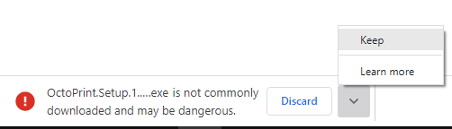
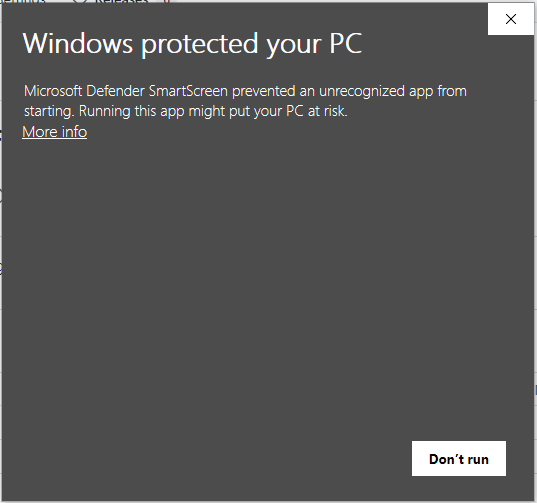
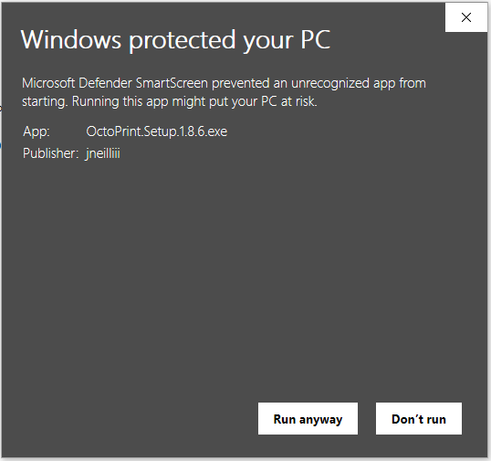
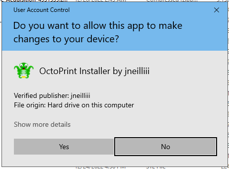

# OctoPrint Windows Installer

This repository uses a GitHub action to make a bundled installer for OctoPrint on Windows. It uses [WinPython](https://github.com/winpython/winpython), [winsw](https://github.com/winsw/winsw), and automates the process of creating a venv, installing OctoPrint in it, and adding an OctoPrint service in Windows.

## System Requirements

The minimum requirements to use the Windows Installer are:
* 64 bit OS
* Windows 10 or newer

## Usage

Head to the [latest release](https://github.com/jneilliii/OctoPrint-WindowsInstaller/releases/latest) and download the built installer from the bottom of the release.

While downloading the installer exe your browser may prompt that the file is dangerous, accept any warnings as shown below in Chrome by selecting `Keep`.

During initial install you may get the SmartScreen warning because the installer is not signed by a MS trusted certificate. Unfortunately, I'm not investing the money to acquire one of those, feel free to download this repo and scan it if you are concerned with what's included. 

To continue with the installation press the `More info` link and then press the `Run anyway` button.

You may be presented with a UAC prompt for admin rights once the install starts. Press the `Yes` button and continue with the installation wizard. 

## Building the installer

To manually build you will need to pass `/DMyAppVersion="x.x.x"` to InnsoSetup compile command. This is automatically handled by the GitHub Action.  

